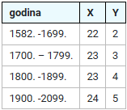
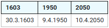

## 1. Zadatak

Napisati funkciju `odrediMjesecIDanUskrsa` tipa void koja kao parametre prima redom:

- `godina` tipa `int`, za kojega možete pretpostaviti da će biti četveroznamenkasti pozitivni broj iz
  intervala [1582, 2099] (nije potrebno provjeravati)
- `mjesec` tipa pokazivač na objekt tipa `int`
- `dan` tipa pokazivač na objekt tipa `int`

Funkcija `odrediMjesecIDanUskrsa` u pozivajući program preko parametara `mjesec` i `dan`, za zadanu godinu (`godina`)
treba vratiti `mjesec` i `dan` Uskrsa izračunatog prema Gaussovom algoritmu (opisan u nastavku).

Za izračun mjeseca i dana Uskrsa koristite X i Y, čija vrijednost ovisi o godini.
Vrijednosti X i Y su dane u priloženoj tablici:



Pomoću X i Y izračunaju se sljedeće vrijednosti prema formulama:

- A = ostatak dijeljenja godine s 19
- B = ostatak dijeljenja godine s 4
- C = ostatak dijeljenja godine sa 7
- D = ostatak dijeljenja (A * 19 + X) s 30
- E = ostatak dijeljenja (2 * B + 4 * C + 6 * D + Y) sa 7

Prema Gaussovom algoritmu, datum Uskrsa je (22 + D+ E). ožujka ako (22 +D + E) ne prelazi 31,
inače je (D + E -9). travnja.

Za kontrolu ispravnosti rada funkcije u nastavku su datumi Uskrsa za nekoliko godina:



Kao rješenje predati samo definiciju funkcije, bez naredbi `#include` i glavnog programa.

[Rješenje zadatka](1.c)

## 2. Zadatak

Napisati definiciju funkcije `pokNaNajblizuTocku` koja u zadanom jednodimenzijskom polju od `n` članova polja tipa
`tocka_t` pronalazi točku koja je najbliža ishodištu pravokutnog koordinatnog sustava, a zatim preko imena funkcije u
pozivajući program vraća pokazivač na dotičnu točku (tj. pokazivač na pronađeni član polja).

Ako u polju postoji više točaka koje imaju jednaku najmanju udaljenost do ishodišta, funkcija u pozivajući program treba
vratiti pokazivač na posljednju od takvih točaka u polju.

Udaljenost između točaka $\left(x_1, y_1\right)$ i $\left(x_2, y_2\right)$ u pravokutnom koordinatnom sustavu izračunava
se pomoću izraza $\sqrt{\left(x_2 - x_1 \right)^2 + \left(y_2 - y_1 \right)^2}$.

Primjer 1: U zadanom polju točaka `(0.7, 1.2), (0.7, 1.1), (-1.0, 1.0), (-1.1, -1.0)`, druga točka je najbliža
ishodištu, što znači da funkcija u pozivajući program treba vratiti pokazivač na drugi član polja.

Primjer 2: U zadanom polju točaka `(1.5, 2.5), (1.7, 2.6), (-2.5, -1.5), (1.9, -3.1), (2.1, -4.1)`, ishodištu su
najbliže (jednako blizu) prva i treća točka, što znači da funkcija u pozivajući program treba vratiti pokazivač na treći
član polja.

Primjer 3: U zadanom polju točaka `(2.e+121, 2.e+121), (1.e+121, 1.e+121), (4.e+121, 4.e+121)`, druga točka je najbliža
ishodištu, što znači da funkcija u pozivajući program treba vratiti pokazivač na drugi član polja.

```c++
#include <stdio.h>
#include <math.h>

typedef struct {
    double x;
    double y;
} tocka_t;

/* POCETAK DEFINICIJE */
ovdje_navesti_tip_funkcije pokNaNajblizuTocku(ovdje_navesti_prvi_parametar, int n) {
    ovdje_napisati_tijelo_funkcije    
}
/* KRAJ DEFINICIJE */

int main(void) {
    ...
}
```

Napomena: Kao rješenje dostaviti samo definiciju funkcije `pokNaNajblizuTocku`, odnosno dio programskog koda koji se u
gore prikazanom modulu nalazi između `/* POCETAK DEFINICIJE */` i `/* KRAJ DEFINICIJE */`.

[Rješenje zadatka](2.c)

## 3. Zadatak

Napisati definiciju funkcije `generirajLozinku` prototipa

```c++
void generirajLozinku (unsigned int sjeme, const char *znakoviZaLozinku, int duljLoz, char *lozinka);
```

koja kao parametre prima redom:

- inicijalnu vrijednost za generator pseudoslučajnih brojeva
- pokazivač na prvi član niza znakova (string) koji treba koristiti pri generiranju lozinke
- duljinu lozinke koju je potrebno generirati
- pokazivač na prvi član niza znakova (string) kojeg treba popuniti zadanim brojem nasumično odabranih znakova

Funkcija treba generirati lozinku `lozinka` duljine `duljLoz` tako da pomoću generatora pseudoslučajanih brojeva odabire
znakove sadržane u nizu znakova `znakoviZaLozinku`.

Važno: za transformaciju pseudoslučajnog broja u broj iz željenog intervala koristiti operator %.

Primjer 1:
Za zadano sjeme `500`, niz `123456789qwertzuiopasdfghjklyxcvbnmQWERTZUIOPASDFGHJKLYXCVBNM#$&()` i duljinu `10` funkcija
generira lozinku `dH5LHZqr`&I (ako testirate na operacijskom sustavu Windows), odnosno `w4azVBdI)p` (ako testirate na
operacijskom sustavu Linux ili u sustavu Edgar).

Primjer 2:
Za zadano sjeme `7351`, niz `ABC-123` i duljinu `15` funkcija generira lozinku `2--AA2-BC2-BAB-` (ako testirate na
operacijskom sustavu Windows), odnosno `C1BA3B-31C2BC2B` (ako testirate na operacijskom sustavu Linux ili u sustavu
Edgar)

Kao rješenje predati samo definiciju funkcije, bez naredbi `#include` i glavnog programa.

[Rješenje zadatka](3.c)

## 4. Zadatak

U nekoj binarnoj datoteci nalaze se podaci o plaćama osoba. Zapisi su u obliku:

```c++
struct record {
    int code;
    int salary;
    char name[40 + 1];
};
```

Napisati funkciju s prototipom

```c++
void increaseLowest(char *fileName, int percentage)
```

koja u datoteci zadanog imena poveća najnižu plaću za zadani postotak (nije potrebno zaokruživati rezultat).
Ako više osoba ima jednaku najnižu plaću, povećati plaću onoj s najmanjim rednim brojem.

Redni broj zapisa odgovara šifri osobe. Zapis sa šifrom 1 nalazi se na samom početku datoteke.

Napomena: predati samo izvorni kod funkcije, bez deklaracije zapisa i naredbi `#include`. Glavni program, deklaracija i
`#include` kojima se testira funkcionalnost funkcije već su pripremljeni u Edgaru. U funkciji obvezno zatvoriti
datoteku, jer inače načinjene promjene neće biti spremljene ni vidljive programu koji testira funkciju. Nije dozvoljeno
korištenje polja.

Tekstnu datoteku koja se koristi u zadatku možete pronaći pod [salaries.bin](salaries.bin)

[Rješenje zadatka](4.c)

## 5. Zadatak

Podaci su pohranjeni u strukturi

```c++
struct podaci_s {
    char prezime[40 + 1];
    char ime[40 + 1];
    float primanja;
};
```

Funkcija prototipa:

```c++
char *trazenoPrezime(struct podaci_s *pok, int n);
```

kao parametre prima pokazivač na prvi član polja struktura `podaci_s` i cjelobrojnu varijablu `n`, a u pozivajući
program preko imena funkcije vraća `prezime` iz člana polja s indeksom `n`. Čime u donjem programskom odsječku treba
zamijeniti IZRAZ, kako bi funkcija ispravno vratila traženi podatak?

```c++
char *trazenoPrezime(struct podaci_s *pok, int n) {
    return IZRAZ;
}
```

[Rješenje zadatka](5.c)

## 6. Zadatak

Koliko će byteova u memoriji zauzeti sljedeća definicija polja?

```c++
char p[][7] = {
    { 9, 93, 15, 25 },
    { 57, 7, 94, 94, 61, 35 },
    { 81, 17, 35, 30 },
    { 78, 36, 17, 65, 89, 33, 33 },
    { 88, 28, 56, 40, 47, 90 },
    { 65, 60, 71, 48, 41, 93 }
};
```

Ako smatrate da je definicija neispravna ili da se ne može jednoznačno odgovoriti na ovo pitanje, kao odgovor upišite
`ERR`.

[Rješenje zadatka](6.c)

## 7. Zadatak

Funkcija

```c++
char *broji (char *niz, int *brVel, int *brMal);
```

vraća pokazivač na prvi samoglasnik u zadanom nizu te također izračunava i preko parametara vraća broj velikih slova (
`brVel`) i broj malih slova (`brMal`) u zadanom nizu.

Čime u donjem programskom odsječku treba zamijeniti XXXXXXXXXX, kako bi se naredbom printf ispisao prvi samoglasnik,
broj velikih slova (`velika`) i broj malih slova (`mala`) u zadanom nizu?

```c++
int main(void) {
    int velika, mala;
    char *p = NULL;
    char niz[MAX_NIZ + 1];
    fgets(niz, MAX_NIZ + 1, stdin);
    XXXXXXXXXX  
    if (p == NULL) {
        printf("U nizu nema samoglasnika.");
    } else {
        printf("%c\n", *p);
    }
    printf("Velikih: %d\n", velika);
    printf("Malih: %d\n", mala);
    return 0;
}
```

[Rješenje zadatka](7.c)

## 8. Zadatak

Datoteka čijim se zapisima treba pristupiti direktno, znajući samo redni broj zapisa, mora biti:

a) isključivo tekstna, pri čemu zapisi mogu biti različitih duljina

b) isključivo tekstna, pri čemu zapisi moraju biti jednake duljine

c) isključivo binarna, pri čemu zapisi moraju biti jednake duljine

d) tekstna ili binarna, pri čemu zapisi moraju biti jednake duljine

e) isključivo binarna, pri čemu zapisi mogu biti različitih duljina

[Rješenje zadatka](8.c)
