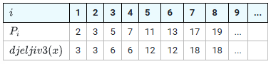
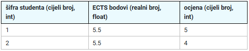

## 1. Zadatak

Napisati program koji će učitati prirodni broj N manji ili jednak 50 koji predstavlja broj članova niza. Ponavljati unos
dok se ne unese ispravan broj.

Potom ispisati N članova niza koji je definiran na sljedeći način:

$a_i = djeljiv3(P_i)$

pri čemu je:

- $P_i$ = i-ti prosti(prim) broj
- $djeljiv3(x)$ = prirodni broj djeljiv s 3 najbliži broju x

Na primjer, djeljiv3(x):



Dakle, i-ti član polja je broj koji je djeljiv s 3 koji je najbliži i-tom prim broju.

- Prvi prim broj je 2, pa je to 3.
- Drugi prim broj je 3, pa je to 3.
- Treći prim broj je 5, pa je to 6 (jer je 6 bliži 5 od 3).
- itd.

Primjeri izvršavanja:

```
Upisite·N·>·0⏎
Upisite·N·>·300⏎
Upisite·N·>·10⏎
3·3·6·6·12·12·18·18·24·30·
```

```
Upisite·N·>·1⏎
3·
```

Napomena:

- znak `↵` ukazuje da na tom mjestu treba "ispisati skok u novi red"
- znak `⏎` da je pritisnuta tipku Enter (odnosno Return) od strane korisnika
- znak `·` da na tom treba ispisati prazninu (space)

[Rješenje zadatka](1.c)

## 2. Zadatak

Učitavati broj članova polja n, koji mora biti prirodni broj, sve dok se ne učita ispravna vrijednost. Učitati n članova
jednodimenzijskog cjelobrojnog polja. Zamijeniti sve članove s parnim indeksom sa susjednim članom koji ima veći indeks.
Ispisati modificirano polje. Ako je broj članova polja neparan, posljednji element u polju ostaje na svome mjestu.

Važno: Program mora završiti s (doslovno, od znaka do znaka)

```c++
for (i = 0; i < n; i = i + 1) {
    printf("%d ", a[i]);
}
return 0;
```

Primjeri izvršavanja programa:

```
Unesite·n·>·6⏎
1·5·3·9·5·8⏎
5·1·9·3·8·5·
```

```
Unesite·n·>·5⏎
3·9·8·6·4⏎
9·3·6·8·4·
```

```
Unesite·n·>·-4⏎
Unesite·n·>·1⏎
2·⏎
2·
```

Napomena:

- znak `↵` ukazuje da na tom mjestu treba "ispisati skok u novi red"
- znak `⏎` da je pritisnuta tipku Enter (odnosno Return) od strane korisnika
- znak `·` da na tom treba ispisati prazninu (space)

[Rješenje zadatka](2.c)

## 3. Zadatak

Učitati vrijednosti za broj redaka `m` i broj stupaca `n` dvodimenzijskog polja cijelih brojeva (matrice). Ne treba
provjeravati jesu li upisane vrijednosti ispravne.

Potom učitati:

- vrijednosti članova cjelobrojnog polja po retcima
- cijeli broj koji predstavlja traženu udaljenost između susjednih elemenata u retku.
  Udaljenost računati oduzimanjem elementa s manjim indeksom stupca od elementa s većim indeksom stupca.
  Za svaki redak matrice ispisati broj parova elemenata matrice, koji pripadaju tom retku, čija je udaljenost jednaka
  traženoj udaljenosti.

Primjeri izvršavanja programa:

```
Unesite·m·>·1⏎
Unesite·n·>·4⏎
1·2·3·4⏎
Unesite·trazenu·udaljenost·>·1⏎  
1.·redak,·parova:·3↵
```

```
Unesite·m·>·3⏎
Unesite·n·>·4⏎
3·1·-1·4⏎
5·7·-3·-1⏎
-1·1·-1·-3⏎
Unesite·trazenu·udaljenost·>·-2⏎  
1.·redak,·parova:·2↵
2.·redak,·parova:·0↵
3.·redak,·parova:·2↵
```

Napomena:

- znak `↵` ukazuje da na tom mjestu treba "ispisati skok u novi red"
- znak `⏎` da je pritisnuta tipku Enter (odnosno Return) od strane korisnika
- znak `·` da na tom treba ispisati prazninu (space)

[Rješenje zadatka](3.c)

## 4. Zadatak

U varijablu naziva `ulaz` s tipkovnice učitati niz znakova (string) koji zajedno s eventualno učitanom oznakom novog
retka sigurno neće biti dulji od 30 znakova.

U varijabli naziva `izlaz` formirati novi niz znakova koji će sadržavati sva mala slova ulaznog niza znakova, ali tako
da se u izlaznom nizu svako malo slovo iz ulaznog niza pojavi točno jednom.

Na kraju, na zaslon ispisati nizove znakova `izlaz` i `ulaz`. Za ispis na zaslon moraju se koristiti ovdje navedene
naredbe, odnosno posljednje tri naredbe u programu (u funkciji main) moraju biti napisane točno ovako:

```c++
printf("Izlaz: %s\n", izlaz);
printf(" Ulaz: %s", ulaz);
return 0;
```

Primjeri izvršavanja programa:

```
Upisite·ulazni·niz·>·bbBaacc·egf·!1234567890·NNmmm↵
Izlaz:·bacegfm↵
·Ulaz:·bbBaacc·egf·!1234567890·NNmmm↵
```

```
Upisite·ulazni·niz·>·↵
Izlaz:·↵
·Ulaz:·↵
```

```
Upisite·ulazni·niz·>·BB·CC·DD↵
Izlaz:·↵
·Ulaz:·BB·CC·DD↵
```

[Rješenje zadatka](4.c)

## 5. Zadatak

Čime najkraće zamijeniti `?` u sljedećoj naredbi tako da cjelobrojna varijabla i dobije vrijednost realne varijable `f`
zaokruženu na cijeli broj?

```
i = f + ?;
```

[Rješenje zadatka](5.c)

## 6. Zadatak

Napisati odsječak programa označen sa `(*)` koji će definirati polje `rezultati` od MAX elemenata i pri definiciji dodijeliti vrijednost (inicijalizirati) prva 2 elementa polja.
Elementi polja su strukture.
Članovi strukture kao i vrijednosti članova za prva dva elementa polja `rezultati` definirana su donjom tablicom:



Imena članova strukture odredite tako da se programski kod u nastavku može izvršiti bez greške.
```c++
#include <stdio.h>
#define MAX 10

int main(void) {
  float tezinski_prosjek = 0.f, suma_ECTS = 0.f;
  int sifStudent;
  // (*) definicija polja rezultati čiji su elementi struktura i inicijalizacija prva 2 elementa
  scanf("%d", &sifStudent);

  for (int i = 0; i < MAX; i++)
      if (rezultati[i].sif_student == sifStudent && rezultati[i].ocjena > 1) {
          tezinski_prosjek += rezultati[i].ECTS * rezultati[i].ocjena;
          suma_ECTS += rezultati[i].ECTS;
      }
  if (suma_ECTS > 0.f)
     printf("Tezinski prosjek: %5.2f\n", tezinski_prosjek / suma_ECTS);
  return 0;
}
```
Napomena: početak i završetak programa prikazan u tekstu zadatka nije potrebno pisati. Pretpostavite da su preostali članovi polja rezultati ispravno popunjeni (u dijelu programa koji nije prikazan).

[Rješenje zadatka](6.c)
