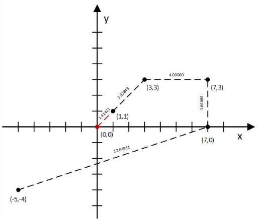
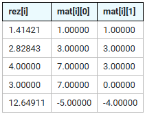
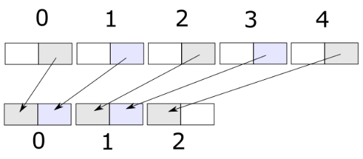
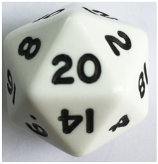

## 1. Zadatak

Napisati definiciju funkcije `zamijeniGlavnaD` s prototipom

```c++
float zamijeniGlavnaD(float *p, int n);
```

Funkcija treba zrcalno zamijeniti vrijednosti elemenata u glavnoj dijagonali kvadratne matrice (tj. dvodimenzionalnog
polja) s n redaka i stupaca, čiji su elementi tipa `float`.

Na primjer, za kvadratnu matricu `p` reda 5, potrebno će biti zamijeniti vrijednosti članova `p[0][0]` i `p[4][4]` te
vrijednosti članova `p[1][1]` i `p[3][3]`.

Funkcija preko imena treba vratiti zbroj vrijednosti članova sporedne dijagonale.

Primjer 1:

```
1.20  2.00  
3.10  4.80
```

treba promijeniti u:

```
4.80  2.00  
3.10  1.20
```

pri čemu funkcija vraća vrijednost 5.10: (2.00 + 3.10 = 5.10)

Primjer 2:

```
1.23  2.00  3.40
4.10  5.80  6.00
7.75  8.10  9.30
```

treba promijeniti u:

```
9.30  2.00  3.40
4.10  5.80  6.00
7.75  8.10  1.23
```

pri čemu funkcija vraća vrijednost 16.95: (3.40 + 5.80 + 7.75 = 16.95)

Napomena: Ne treba predati glavni program, niti naredbe `#include`, potrebno je predati samo funkciju.

Primjer glavnog programa za testiranje funkcije izvan Edgara

```c++
#include <stdio.h>
int main(void) {
    int n;
    scanf("%d", &n);
    float array[n][n];
    int i, j;
    for (i = 0; i < n; ++i)
    for (j = 0; j < n; ++j)
    scanf("%f", &array[i][j]);
    
    float rez = /* ovdje ugraditi poziv funkcije */ ;
    
    for (i = 0; i < n; ++i) {
        for (j = 0; j < n; ++j) {
            printf("%7.2f", array[i][j]);
        }
        printf("\n");
    }
    printf("Suma na sporednoj: %7.2f", rez);
    
    return 0;
}
```

[Rješenje zadatka](1.c)

## 2. Zadatak

Napišite funkciju prototipa:

```c++
double dist2D(double *mat, double *rez, int vel);
```

koja izračunava duljinu linije u Kartezijevom koordinatnom sustavu opisane nizom točaka Ti(xi, yi) kao u primjeru. Točke
su zapisane u dvodimenzijskom polju `mat` tako da svaki redak i predstavlja jednu točku Ti: koordinata xi zapisana je u
prvom stupcu, a koordinata yi u drugom stupcu polja. Parameter `vel` definira duljinu polja `mat`.

Funkcija treba:

u zadano jednodimenzijsko polje `rez` pohraniti udaljenost točke Ti od prethodne točke Ti-1, s tim da za prvi (nulti)
redak to treba biti udaljenost točke T1 od (0,0), tj. od ishodišta koordinatnog sustava.
preko imena funkcija vratiti ukupnu duljinu linije.
Primjer za 5 točaka (i = 0, 1, 2, 3, 4):





Ukupna duljina linije = `23.89175`

Napomena: ne treba predati glavni program, niti naredbe `#include`, potrebno je predati samo funkciju.

Primjer glavnog programa za testiranje funkcije izvan Edgara

```c++
#include <stdio.h>
#include <math.h>
int main(void) {
    int vel;
    double duz;

    scanf("%d", &vel);
    
    double mat[vel][2];
    double rez[vel];
    
    for (int i = 0; i < vel; i++)
    {
        scanf("%lf %lf", &mat[i][0], &mat[i][1]);
    }
    
    // ovdje ugraditi poziv funkcije
    
    for (int i = 0; i < vel; i++)
    {
        printf("%.5lf %.5lf %.5lf\n", rez[i], mat[i][0], mat[i][1]);
    }
    
    printf("%.5lf", duz);

    return 0;
}
```

[Rješenje zadatka](2.c)

## 3. Zadatak

Napisati funkciju s prototipom

```c++
void delCharFromName(char *name, char c);
```

koja iz niza name izbacuje sve pojave znaka c.

Primjeri izvršavanja:

Niz "mali Perica" uz znak 'a' mijenja se u "mli Peric".

Niz "ccc" uz znak 'c' mijenja se u "" (prazan niz).

Niz "FER" uz znak 'e' ostaje nepromijenjen.

Napomena: ne treba predati glavni program, deklaraciju strukture, niti naredbu #include, potrebno je predati samo
funkciju.

Primjer glavnog programa za testiranje funkcije izvan Edgara

```c++
#include <stdio.h>
// definicija funkcije delCharFromName
int main(void) {
    char name[128+1];
    char c;
    printf("Unesite niz > ");
    fgets(name, 128, stdin);
    printf("Unesite znak > ");
    scanf("%c", &c);
    // ovdje ugraditi poziv funkcije
    printf("%s", name);
    return 0;
}
```

[Rješenje zadatka](3.c)

## 4. Zadatak

Napisati definiciju funkcije čiji je prototip

```c++
int brojJednakih(char *trgovina1, char *trgovina2);
```

Parametrima `trgovina1` i `trgovina2` zadana su imena tekstnih datoteka s podacima o artiklima koje prodaje Trgovina 1,
odnosno Trgovina 2.

Zapisi u datotekama sadrže šifru artikla (cijeli broj s točno 4 znamenke) i cijenu artikla (realni broj s dvije znamenke
iza decimalne točke) koji su međusobno odvojeni znakom `#.` Zapisi datoteka nisu poredani prema šiframa. Primjeri
datoteka s podacima o artiklima nalaze se u prilogu.

Funkcija treba vratiti broj artikala koji se istovremeno prodaju u obje zadane trgovine. Ako se tok za bilo koju od
zadanih datoteka ne uspije otvoriti, funkcija treba vratiti cijeli broj `-1`. Napomena: u funkciji nije dopušteno
koristiti polja (array).

Primjer 1. Ako se funkciji zadaju imena datoteka trg1.txt i trg2.txt, funkcija treba vratiti `3` (jer se u obje trgovine
prodaju artikli sa šiframa 5003, 2001 i 9004).

Primjer 2. Ako se funkciji zadaju imena datoteka trg1.txt i trg2razl.txt, funkcija treba vratiti `0` (jer se niti jedan
od artikala ne prodaje u obje trgovine).

Primjer 3. Ako se funkciji zadaju imena datoteka trg1.txt i nemaTakveDatoteke.txt, funkcija treba vratiti `-1` (jer se
tok za datoteku nemaTakveDatoteke.txt neće moći otvoriti s obzirom da datoteka ne postoji).

Napomena: ne treba pisati glavni program, niti naredbe `#include`, potrebno je napisati samo definiciju funkcije
`brojJednakih`, odnosno dio programskog koda koji se u dolje prikazanom modulu nalazi između `/* POCETAK DEFINICIJE */`
i `/* KRAJ DEFINICIJE */`.

Primjer programa za testiranje funkcije izvan Edgara

```c++
#include <stdio.h>
/* POCETAK DEFINICIJE */
// ovdje napisati definiciju funkcije brojJednakih
/* KRAJ DEFINICIJE */

int main(void) {
    char imePrveDat[128], imeDrugeDat[128];
    int rez;
    scanf("%s %s", imePrveDat, imeDrugeDat);
    // ovdje ugraditi poziv funkcije
    printf("Rezultat = %d", rez);
    return 0;
}
```

Tekstne datoteke koje se koriste u zadatku možete pronaći pod
[trg1.txt](trg1.txt), [trg2.txt](trg2.txt), [trg2razl.txt](trg2razl.txt)

[Rješenje zadatka](4.c)

## 5. Zadatak

Napišite funkciju prototipa

```c++
void compress (unsigned char *p, int len)
```

koja će sažeti zadano polje malih cijelih brojeva od jednog bajta.
Naime, u zadanom polju su brojevi koji koriste samo manje značajna četiri bita ("desna polovica"), odnosno sadrže samo
vrijednosti u intervalu [0, 15].
Polje je potrebno transformirati na način da se dva broja sažimaju u jedan, pri čemu se brojevi:

- na parnim indeksima smještaju u lijevu polovicu sažetog broja
- ne neparnim indeksima smještaju u desnu polovicu sažetog broja

Slika ilustrira traženi postupak sažimanja niza od pet brojeva koji su pohranjeni u pet bajtova na niz brojeva
pohranjenih u tri bajta:



Pazite na polja s neparnim brojem članova (upravo primjer sa slike) gdje i zadnji broj treba pomaknuti na lijevu stranu
sažetog broja (na slici indeks 4, odnosno novi indeks 2).

Potrebno je izmijeniti zadano polje `*p`, što je jasno i iz prototipa funkcije. Drugu polovicu polja (na slici s
indeksom 3 i 4) ostaviti kakva je, smatra se da ga pozivajući program neće koristiti.

Na primjer:

- u zadanom polju s članovima {1, 2, 3, 4} prva dva člana trebaju biti promijenjena u {18, 52}.
- u zadanom polju s članovima {1, 2, 3} prva dva člana trebaju biti promijenjena u {18, 48}.

Napomena: ne treba predati glavni program, niti naredbe `#include`, potrebno je predati samo funkciju.

Primjer glavnog programa za testiranje funkcije izvan Edgara

```c++
int main(void) {
    int len;
    scanf ("%d", &len);
    unsigned char polje[len];
    for (int i = 0; i < len; i++) {
        polje[i] = i + 1;
    }    
    // ovdje ugraditi poziv funkcije
    for (int i = 0; i < len/2 + (len%2); i++) {
        printf("%u ", polje[i]);
    }
    return 0;
}
```

[Rješenje zadatka](5.c)

## 6. Zadatak

Napisati funkciju s prototipom

```c++
int playRollTheDice (int noOfDiceSides, int diceStartNumber, int noOfRolls);
```

koja će simulirati igru bacanja "kockice" za dva igrača.
Igraća "kockica" može imati proizvoljan broj strana (parametar `noOfDiceSides`), a početni broj također ne mora biti 1 (
parametar `diceStartNumber`).
Početni broj ujedno predstavlja razliku između dva uzastopna broja na stranama "kockice".
Na primjer "kockica" prikazana na slici ima 20 strana i početni broj je 2 nakon čega slijede 4, 6, 8, ..., 40.



Igru u funkciji treba implementirati na sljedeći način:

- prvo zadani broj puta (parametar `noOfRols`) treba simulirati bacanje "kockice" za prvog igrača
- potom zadani broj puta treba simulirati bacanje "kockice" za drugog igrača
- bacanje "kockice" simulirati pomoću generatora pseudoslučajnih brojeva odabirom strane na koju je "kockica" pala. Pri
  tom treba iskoristiti svaki dobiveni pseudoslučajni broj (ne preskakati dobivene brojeve).
  Primjer: ako "kockica" ima 20 strana i na njima su samo parni brojevi počev od 2, slučajni broj treba treba
  predstavljati redni broj strane (od 1 do 20), a broj na dobivenoj strani dobiti množenjem s početnim brojem tj. 2.
- pobjednik je igrač s većom sumom dobivenih brojeva na stranama "kockice"

Funkcija kao rezultat treba vratiti redni broj pobjednika: 1 odnosno 2, a ako nema pobjednika funkcija treba vratiti 0.

Važno: Interval pseudoslučajnih brojeva prilagoditi traženom intervalu uz pomoć izraza koji koristi operaciju ostatka
cjelobrojnog dijeljenja (prikazan na predavanjima). Funkcija ne smije sadržavati inicijalizaciju generatora
pseudoslučajnih brojeva.

Primjer:
Za inicijalnu vrijednost generatora pseudoslučajnih brojeva postavljenu na `500` i `noOfDiceSides = 20`,
`diceStartNumber = 4` i `noOfRolls = 5`:

prvi igrač: 48, 44, 4, 72, 28, suma = 196, drugi igrač: 12, 64, 4, 40, 12, suma = 132, funkcija vraća 1 (ako testirate
na operacijskom sustavu Windows), odnosno
prvi igrač: 76, 72, 72, 44, 48, suma = 312, drugi igrač: 76, 16, 60, 40, 44 suma = 236 (ako testirate na operacijskom
sustavu Linux ili u sustavu Edgar).
Napomena: ne treba predati glavni program, niti naredbe #include, potrebno je predati samo funkciju.

Primjer glavnog programa za testiranje funkcije izvan Edgara

```c++
#include <stdio.h>
#include <stdlib.h>

int playRollTheDice(int noOfDiceSides, int diceStartNumber, int noOfRolls);

int main(void){
    int seed, noOfDiceSides, diceStartNumber, noOfRolls;
    printf("Upisi redom: sjeme, broj stranica na kockici, pocetni broj na kockici i broj bacanja > ");
    scanf("%d %d %d %d", &seed, &noOfDiceSides, &diceStartNumber, &noOfRolls);

    srand(seed);
    printf("Pobjednik je: %d ",  /* ovdje ugraditi poziv funkcije */);
    
    return 0;
}
```

[Rješenje zadatka](6.c)
