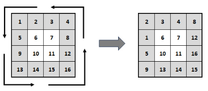

## 1. Zadatak

Učitavati broj članova polja n, koji mora biti pozitivni cijeli broj veći od , sve dok se ne učita ispravna vrijednost.
Učitati n članova jednodimenzijskog cjelobrojnog polja. Učitani cijeli brojevi predstavljaju članove niza.

Ako je niz aritmetički $(a_{n}=a_{1} + (n - 1) * d)$, odnosno niz u kojem je razlika svakog člana i njegovog prethodnika
stalan broj, potrebno je izračunati te potom i ispisati razliku aritmetičkog niza $(d)$ s porukom oblika:

A·>·vrijednost izračunate razlike aritmetičkog niza⏎
Ako niz nije aritmetički potrebno je ispisati

```
NIJE⏎
```

Primjeri izvršavanja programa:

```
Unesite·n·>·4⏎
Unesite·clanove·niza·>·3·9·15·21⏎
A·>·6
```

```
Unesite·n·>·-5⏎
Unesite·n·>·2⏎
Unesite·n·>·5⏎
Unesite·clanove·niza·>·-5·-10·-15·-20·-25⏎
A·>·-5
```

```
Unesite·n·>·4⏎
Unesite·clanove·niza·>·2·4·8·16⏎
NIJE
```

Napomena:

- znak `↵` ukazuje da na tom mjestu treba "ispisati skok u novi red"
- znak `⏎` da je pritisnuta tipku Enter (odnosno Return) od strane korisnika
- znak `·` da na tom treba ispisati prazninu (space)

[Rješenje zadatka](1.c)

## 2. Zadatak

Učitati dva niza znakova od kojih niti jedan, zajedno s oznakom novog reda i oznakom `\0`, sigurno neće biti dulji od 20
znakova. Za učitavanje nizova koristiti funkciju `fgets`. Iz oba učitana niza izbaciti oznake novog reda. Načiniti novi
niz znakova spajanjem (nadovezivanjem) prvog učitanog niza i obrnuto okrenutog drugog niza. Dobiveni novi niz znakova
ispisati na zaslon. Ne koristiti `<string.h>`.

Primjeri izvršavanja:

```
Unesite·prvi·niz·>·abcDe⏎
Unesite·drugi·niz·>·fGijK⏎
Spojeni·niz·>·abcDeKjiGf↵
```

```
Unesite·prvi·niz·>·Unska·3⏎
Unesite·drugi·niz·>·Plitvicka·1⏎
Spojeni·niz·>·Unska·31·akcivtilP↵
```

Napomena:

- znak `↵` ukazuje da na tom mjestu treba "ispisati skok u novi red"
- znak `⏎` da je pritisnuta tipku Enter (odnosno Return) od strane korisnika
- znak `·` da na tom treba ispisati prazninu (space)

[Rješenje zadatka](2.c)

## 3. Zadatak

Napišite program za posmak elemenata vanjskog ruba kvadratne matrice cijelih brojeva suprotno od smjera kazaljke na
satu. Učitajte red matrice uz provjeru učitane vrijednosti (red je u rasponu [2, 10]), učitajte vrijednosti elemenata
matrice, ispišite učitanu matricu, promijenite elemente matrice prema zadanom pravilu te ispišite stvorenu posmaknutu
matricu. Nije dopušteno stvaranje pomoćne matrice!



Primjeri izvršavanja:

```
Ucitajte·red·matrice>·21↵
Ucitajte·red·matrice>·0↵
Ucitajte·red·matrice>·4↵
Ucitajte·16·elemenata·cjelobrojne·matrice>·1·2·3·4·5·6·7·8·9·10·11·12·13·14·15·16↵
Ucitana·matrica:↵
···1···2···3···4↵
···5···6···7···8↵
···9··10··11··12↵
··13··14··15··16↵
↵
Posmaknuta·matrica:↵
···2···3···4···8↵
···1···6···7··12↵
···5··10··11··16↵
···9··13··14··15↵
```

Napomena: Znak `↵` ukazuje da na tom mjestu treba "ispisati skok u novi red" ili pritisnuti tipku Enter (odnosno
Return), a znak `·` da na tom mjestu treba ispisati prazninu (space).

[Rješenje zadatka](3.c)

## 4. Zadatak

Napisati program koji će odrediti koliko puta se zadani binarni obrazac pojavljuje u nekom broju.
Potrebno je učitati tri vrijednosti:

1. prirodni broj bez predznaka od 4 bajta (npr. 117 = `0000 0000 0000 0000 0000 0000 0111 0101`)
    - binarni obrazac koji se zadaje s dvije vrijednosti. Recimo da želimo obrazac `01`, on se učitava kao:
2. prirodni broj `1`
3. broj bitova obrasca `2` (broj bitova se mora zadati jer obrazac može imati vodeće nule, kao u našem primjeru)

Zatim je potrebno odrediti i ispisati koliko puta se obrazac pojavljuje u broju.

Obrasci se u broju mogu preklapati - treba brojiti svako pojavljivanje.
Npr. u broju `00010101` se obrazac `101` pojavljuje dvaput.

Primjeri izvršavanja:

```
117·1·2↵
Obrazac·se·pojavljuje·3·puta.
```

```
21·5·3↵
Obrazac·se·pojavljuje·2·puta.
```

Primijetite da ako se uz broj bitova 1:

- za obrazac unese 1 - onda se broji broj jedinica u binarnom broju
- za obrazac unese 0 - onda se broji broj nula u binarnom broju

Napomena: Znak `↵` ukazuje da na tom mjestu treba "ispisati skok u novi red" ili pritisnuti tipku Enter (odnosno
Return), a znak `·` da na tom mjestu treba ispisati prazninu (space).

[Rješenje zadatka](4.c)
