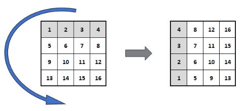

## 1. Zadatak

S tipkovnice učitati jednu znamenku. Nije potrebno provjeravati je li znamenka ispravno učitana.

Ispisati, od većih vrijednosti prema manjima, sve troznamenkaste prim brojeve koji sadrže unesenu znamenku.
Također ispisati zbroj tih brojeva.

Prim brojevi su svi prirodni brojevi veći od 1 koji su bez ostatka djeljivi samo s 1 i sa samim sobom.

Primjeri izvršavanja:

```
Upisite·znamenku·>·8↵
983·887·883·881·877·863·859·857·853·839·829·827·823·821·811·809·787·683·587·487·389·383·283·281·181↵
Zbroj:·17763
```

```
Upisite·znamenku·>·0
907·809·709·701·607·601·509·503·409·401·307·109·107·103·101↵
Zbroj:·6883
```

Napomena: Znak `↵` ukazuje da na tom mjestu treba "ispisati skok u novi red" ili pritisnuti tipku Enter (odnosno
Return), a znak `·` da na tom mjestu treba ispisati prazninu (space).

[Rješenje zadatka](1.c)

## 2. Zadatak

Program treba od korisnika zatražiti broj elemenata 1D polja i potom unos tih elemenata.
Elementi polja smiju biti samo znamenke 0-9. Korisnikov unos ne treba provjeravati.

Nakon unosa brojeva, treba pronaći položaj (indekse) najmanjeg i najvećeg broja u polju te potom ispisati sve elemente
polja u intervalu indeksa od indeksa najmanjeg broja prema indeksu najvećeg (uključujući rubne), bez obzira na položaj
najmanjeg i najvećeg broja u polju. Ako se najmanji ili najveći broj u polju ponavljaju, kao granice ispisa uzeti
indekse prvih pojava tih brojeva gledano od početka polja.

Primjer 1:

```
Upisi·kapacitet·(velicinu)·polja·>·7⏎
Upisi·7·brojeva 0-9·>·2·1·3·1·5·1·4⏎
1315
```

Primjer 2:

```
Upisi·kapacitet·(velicinu)·polja·>·6⏎
Upisi·6·brojeva·0-9·>·2·5·3·1·4·5⏎
135
```

Napomena: Znak `↵` ukazuje da na tom mjestu treba "ispisati skok u novi red" ili pritisnuti tipku Enter (odnosno
Return), a znak `·` da na tom mjestu treba ispisati prazninu (space).

[Rješenje zadatka](2.c)

## 3. Zadatak

S tipkovnice učitati dva niza znakova s1 i s2 koji mogu sadržavati razmake.
Učitani nizovi, uključujući oznaku novog retka, sigurno neće biti dulji od 100 znakova.
Iz učitanih nizova izbaciti oznaku novog retka.

Zatim usporediti nizove znakova s1 i s2 prema abecednom redoslijedu:

- ignorirajući (preskačući) praznine i
- ne praveći razliku između velikih i malih slova.

Ispisati u kojem su odnosu nizovi u skladu s primjerima izvršavanja.

Primjeri izvršavanja:

```
Upisite·s1·>·NULL·character↵
Upisite·s2·>·null···CHARACTER··↵
(NULL·character)=(null···CHARACTER··)↵
```

```
Upisite·s1·>·Charles···↵
Upisite·s2·>·charlesI↵
(Charles···)<(charlesI)↵
Razlika·na·indeksima:·(s1:10, s2:7)
```

Indeksi kreću od 0.
Primijetite da se gornja dva niza (uz ignoriranje praznina) razlikuju na znaku za kraj niza u s1 (indeks:10), odnosno
slovu I u s2 (indeks:7)

```
Upisite·s1·>·Interliber··S↵
Upisite·s2·>·interliber↵
(Interliber··S)>(Interliber)↵
Razlika·na·indeksima:·(s1:12, s2:10)
```

Napomena: Znak `↵` ukazuje da na tom mjestu treba "ispisati skok u novi red" ili pritisnuti tipku Enter (odnosno
Return), a znak `·` da na tom mjestu treba ispisati prazninu (space).

[Rješenje zadatka](3.c)

## 4. Zadatak

Napišite program za ispis kvadratne matrice cijelih brojeva rotirane za 90 stupnjeva suprotno od smjera kazaljke na
satu. Učitajte red matrice uz provjeru učitane vrijednosti (red može biti u rasponu [1, 10]), učitajte vrijednosti
elemenata matrice i ispišite rotiranu matricu. Ispišite početnu matricu i rotiranu matricu. Ispišite broj pozitivnih i
broj negativnih članova matrice.



Primjer izvršavanja:

```
Ucitajte·red·matrice>·211↵
Ucitajte·red·matrice>·0↵
Ucitajte·red·matrice>·4↵
Ucitajte·16·elemenata·cjelobrojne·matrice>·1·2·3·4·5·6·7·8·9·10·11·12·13·14·15·16↵
Ucitana·matrica:↵
···1···2···3···4↵
···5···6···7···8↵
···9··10··11··12↵
··13··14··15··16↵
Matrica·rotirana·ulijevo:↵
···4···8··12··16↵
···3···7··11··15↵
···2···6··10··14↵
···1···5···9··13↵
Pozitivnih:·16↵
Negativnih:·0
```

Napomena: Znak `↵` ukazuje da na tom mjestu treba "ispisati skok u novi red" ili pritisnuti tipku Enter (odnosno
Return), a znak `·` da na tom mjestu treba ispisati prazninu (space).

[Rješenje zadatka](4.c)
