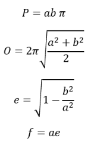
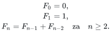

## 1. Zadatak

Napišite funkciju `izracunajElipsu` koja izračunava površinu, opseg, ekscentricitet i duljinu fokusa elipse za zadane
duljine velike i male poluosi te ima sljedeći prototip:

```c++
int izracunajElipsu(double a, double b, double *P, double *O, double *e, double *f);
```

Funkcija kao argumente prihvaća:

- `a` - duljina male poluosi elipse
- `b` - duljina velike poluosi elipse
- `P` - površina elipse
- `O` - opseg elipse
- `e` - ekscentricitet elipse
- `f` - duljina fokusa elipse

Svi argumenti su realni brojevi dvostruke preciznosti, odnosno pokazivači na realne brojeve dvostruke preciznosti, kao
što se može vidjeti iz prototipa funkcije. Izračunate vrijednosti površine, opsega, ekscentriciteta i duljine fokusa
elipse vraćaju se u pozivajuću funkciju preko pokazivača.

Funkcija preko imena vraća sljedeće vrijednosti:

- `0` - ako nije došlo do greške i sve vrijednosti argumenata su uspješno izračunate
- `-1` - argumenti a i b su strogo manji od 0 (`a < 0 && b < 0`)
- `-2` - argument a je strogo manji od 0 (`a < 0`)
- `-3` - argument b je strogo manji od 0 (`b < 0`)
- `-4` - argument a je strogo manji argumenta b (`a < b`)

Za izračun obavezno koristite definiranu konstantu `PI`. Vrijednost konstante iznosi `3.141592654`.

Vrijede sljedeći geometrijski izrazi:



Napomena: Ne treba pisati glavni program, naredbe #include ili #define. Potrebno je napisati samo zadanu funkciju. U
glavnom programu učitavaju se vrijednosti velike i male poluosi elipse sa standardnog ulaza te se poziva zadana
funkcija. Nakon toga ispisuju se vrijednosti dobivene iz funkcije preko imena i pokazivača, ili poruka greške.

Primjeri izvršavanja:

```
Unesi·parametre·elipse·a·i·b:·10.11·5.23↵
Povratna·vrijednost·funkcije:·0↵
P·=·166.11↵
O·=·50.57↵
e·=·0.86↵
f·=·8.65↵
```

```
Unesi·parametre·elipse·a·i·b:·-13.3·5.4↵
Povratna·vrijednost·funkcije:·-2↵
a·<·0↵
```

```
Unesi·parametre·elipse·a·i·b:·987.6·-54.3↵
Povratna·vrijednost·funkcije:·-3↵
b·<·0↵
```

Primjer glavnog programa za testiranje funkcije izvan Edgara

```c++
#include <math.h>
#include <stdio.h>

#define PI 3.141592654

/* OVDJE trebate napisati definiciju funkcije izracunajElipsu */

int main() {
/* Deklaracija varijable za spremanje povratne vrijednosti funkcije */
int ret;   
/* Inicijalizacija varijabli za sporemanje velike i male poluosi elipse, povrsinu, opseg, ekscentricitet i duljinu fokusa elipse */
double a = 0.0, b = 0.0, p = 0.0, o = 0.0, e = 0.0, f = 0.0;

    /* Unos duljina velike i male poluosi elipse sa standardnog ulaza */
    printf("Unesi parametre elipse a i b > ");
    scanf("%lf %lf", &a, &b);

    /* OVDJE trebate pozvati funkciju koja izračunava površinu, opseg, ekscentricitet i duljinu fokusa elipse za zadane duljine velike i male poluosi. DOZVOLJEN JE SAMO JEDAN POZIV FUNKCIJE */

    /* Ispis povratne vrijednosti funkcije na standardni izlaz */
    printf("Povratna vrijednost funkcije: %d\n", ret);
   
    /* Ako je došlo do greške ispisuje se opis greške, ili ispisuju se vrijednosti elipse ako je funkcija uspješno završila */   
    if (ret == -2)
        printf("a < 0\n");
    else if (ret == -3)
        printf("b < 0\n");
    else if (ret == -1)
        printf("a < 0 i b < 0\n");
    else if (ret == -4)
        printf("a < b\n");
    else if (ret == 0) {      
        printf("P = %.2lf\n", p);
        printf("O = %.2lf\n", o);
        printf("e = %.2lf\n", e);
        printf("f = %.2lf\n", f);
       } else
          printf("Nepoznata greska\n");

       return 0;
}
```

[Rješenje zadatka](1.c)

## 2. Zadatak

Napišite funkciju `spojiNizove`:

```c++
void spojiNizove(char *niz1, char *niz2, char *rez);
```

Funkcija prima dva neprazna niza znakova (`niz1` i `niz2`) koje spaja u znakovni niz `rez`.
Spajanje se obavlja naizmjeničnim dodavanjem dva po dva znaka iz ulaznih nizova i to naizmjenično iz `niz1`, `niz2`,
`niz1`, `niz2`, itd.
Ako u podnizu koji se kopira ima samo jedan znak, a ne dva, kopirati samo taj znak.
Ako su ulazni nizovi različitih duljina, na kraj niza `rez` kopiraju se preostali znakovi iz duljeg niza.

Pretpostaviti da u nizu `rez` ima dovoljno mjesta.

Primjer izvedbe:

```
Unesite·prvi·niz·>·abcdefg↵
Unesite·drugi·niz·>·123↵
Spojeni·niz·je·>·ab12cd3efg↵
```

Napomena: Potrebno je predati samo kod tražene funkcije, bez naredbe #include<stdio.h> i glavnog programa.

Primjer glavnog programa za testiranje funkcije izvan Edgara

```c++
#include <stdio.h>
#define MAXNIZ 50

int main(void) {
    char niz1[MAXNIZ+1];
    char niz2[MAXNIZ+1];
    char rez[MAXNIZ*2+1];
    
    printf("Unesite prvi niz > ");
    scanf("%[^\n] ", niz1);
    
    printf("Unesite drugi niz > ");
    scanf("%[^\n] ", niz2);
    
    /* OVDJE treba pozvati funkciju spojiNizove i na zaslon ispisati rezultat */
    printf("Spojeni niz je > ..." ...);

return 0;
}
```

[Rješenje zadatka](2.c)

## 3. Zadatak

Napišite funkciju s prototipom

```c++
void fibNextN(int n)
```

koja će ispisati sljedećih n Fibonaccijevih brojeva (u odnosu na prethodni poziv te funkcije).

Podsjetimo se, Fibonaccijev niz se definira na sljedeći način:



pa tako prvih 10 Fibonaccijevih brojeva glasi: $0, 1, 1, 2, 3, 5, 8, 13, 21, 34, 55,...$

(na predavanjima smo koristili alternativnu definiciju gdje niz počinje od 1, ali ovdje koristimo ovu gore navedenu koja
kreće od 0).

Potrebno je podržati Fibonaccijeve brojeve do 4,294,967,295.

Primjer 1: za priloženi glavni program (vidi Primjer glavnog programa za testiranje funkcije izvan Edgara) treba
ispisati:

```
Prvih·0·clanova·Fibonaccijeva·niza:·↵
Sljedecih·1·clanova·Fibonaccijeva·niza:·0·↵
Sljedecih·2·clanova·Fibonaccijeva·niza:·1·1·↵
Sljedecih·3·clanova·Fibonaccijeva·niza:·2·3·5·↵
Sljedecih·4·clanova·Fibonaccijeva·niza:·8·13·21·34·↵
Sljedecih·5·clanova·Fibonaccijeva·niza:·55·89·144·233·377·↵
Sljedecih·6·clanova·Fibonaccijeva·niza:·610·987·1597·2584·4181·6765·↵
Sljedecih·7·clanova·Fibonaccijeva·niza:·10946·17711·28657·46368·75025·121393·196418·↵
```

Primjer 2: za modificirani priloženi glavni progam u kojem n ide od 7 do 0 treba ispisati:

```
Prvih·7·clanova·Fibonaccijeva·niza:·0·1·1·2·3·5·8·↵
Sljedecih·6·clanova·Fibonaccijeva·niza:·13·21·34·55·89·144·↵
Sljedecih·5·clanova·Fibonaccijeva·niza:·233·377·610·987·1597·↵
Sljedecih·4·clanova·Fibonaccijeva·niza:·2584·4181·6765·10946·↵
Sljedecih·3·clanova·Fibonaccijeva·niza:·17711·28657·46368·↵
Sljedecih·2·clanova·Fibonaccijeva·niza:·75025·121393·↵
Sljedecih·1·clanova·Fibonaccijeva·niza:·196418·↵
Sljedecih·0·clanova·Fibonaccijeva·niza:·↵
```

Napomena: Potrebno je predati samo kod tražene funkcije (i eventualne #include naredbe), bez naredbe `#include<stdio.h>`
i glavnog programa.

Primjer glavnog programa za testiranje funkcije izvan Edgara
#include <stdio.h>

```c++
int main() {
//Kad istestirate program u kojem n ide od 0 do 7, možete okrenuti petlju da n ide od 7 prema 0
for (int n = 0; n <= 7; n++) {
printf("%s %d clanova Fibonaccijeva niza: ", (n == 0) ? "Prvih" : "Sljedecih", n);
fibNextN(n);
printf("\n");
}    
return 0;
}
```

[Rješenje zadatka](3.c)

## 4. Zadatak

Napišite funkciju `podaciZaKatProizv` koja na temelju sadržaja datoteke (čije ime prima preko parametra), za proizvode
koji pripadaju traženoj kategoriji (naziv kategorije funkcija također prima preko parametra) vraća:

- broj proizvoda u toj kategoriji,
- najnižu cijenu proizvoda i
- najvišu cijenu proizvoda.

Ako se tok za zadanu datoteku ne uspije otvoriti, funkcija treba vratiti logičku vrijednost laž, a u suprotnom logičku
vrijednost istina.

Primjer datoteke s podacima o proizvodima nalazi se u prilogu, a u nastavku je prikazan jedan zapis:

```
5#Voce i povrce#Jabuka zlatni delises#1.69
```

Zapisi u tekstnoj datoteci sadrže šifru kategorije proizvoda (cijeli broj), naziv kategorije (niz znakova maksimalno
dugačak 20 znakova), naziv proizvoda (niz znakova maksimalno dugačak 50 znakova) i cijenu proizvoda (realni broj s dvije
znamenke iza decimalne točke) koji su međusobno odvojeni znakom `#`.
Zapisi u datoteci nisu poredani niti prema jednom podatku.

U glavnom programu s tipkovnice učitati naziv datoteke i naziv kategorije proizvoda.
Jednim pozivom funkcije `podaciZaKatProizv` izračunati tražene vrijednosti.
Ako se tok za zadanu datoteku ne uspije otvoriti, u glavnom programu ispisati poruku u skladu s primjerima izvršavanja.
Inače, ispisati tražene tri vrijednosti ili poruku kao u drugom primjeru ako u datoteci nema proizvoda u navedenoj
kategoriji.

Primjeri izvršavanja

```
Naziv·datoteke:·Proizvodi.txt↵
Kategorija·proizvoda:·Svjeza·hrana↵
Broj·proizvoda,·najniza·i·najvisa·cijena:·4·0.50·7.25
```

```
Naziv·datoteke:·Proizvodi.txt↵
Kategorija·proizvoda:·Smrznuti·proizvodi↵
Nema·proizvoda·u·navedenoj·kategoriji.
```

Ako se funkciji zada ime datoteke nemaTakveDatoteke.txt i bilo koji naziv kategorije (npr. Svjeza hrana), funkcija treba
vratiti logičku vrijednost laž (jer se tok za datoteku nemaTakveDatoteke.txt neće moći otvoriti s obzirom da datoteka ne
postoji), a vrijednosti za najnižu i najvišu cijenu te za broj proizvoda se neće ispisivati u glavnom programu pa nisu
važne.
```
Naziv·datoteke:·nemaTakveDatoteke.txt↵
Kategorija·proizvoda:·Svjeza hrana↵
Ne·postoji·datoteka.
```
U nastavku se nalazi program kojeg trebate kopirati (copy-paste) u svoju radnu okolinu ili editor, te u njemu obaviti
potrebne dopune na mjestima koja su označena komentarima. U Edgar kao rješenje predati cijeli program (ne samo
funkciju).

Program kojeg treba dopuniti i predati kao rješenje
#include <stdio.h>
/* POCETAK DEFINICIJE */
// ovdje napisati definiciju funkcije podaciZaKatProizv i potrebne include naredbe
/* KRAJ DEFINICIJE */

int main(void){
char imeDat[128+1];
char nazKat[20+1];
printf("Naziv datoteke: ");
scanf("%s%*c", imeDat);
printf("Kategorija proizvoda: ");
scanf("%[^\n]", nazKat);
int brojProizv;
float najNizaC, najVisaC;

    /* OVDJE napisati definiciju varijable u koju
      ce se pohraniti rezultat kojeg funkcija vraća preko imena i potom pozvati funkciju podaciZaKatProizv*/    
   
    /* OVDJE napisati naredbe kojima se ispisuje rezultat na zaslon
    ...  
        printf("Ne postoji datoteka.");
    ...  
        printf("Nema proizvoda u navedenoj kategoriji.");
    ...      
        printf("Broj proizvoda, najniza i najvisa cijena: ...);
     */
    return 0;

}

Tekstnu datoteku koja se koristi u zadatku možete pronaći pod [Proizvodi.txt](Proizvodi.txt).

[Rješenje zadatka](4.c)
