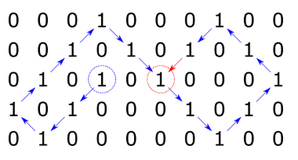
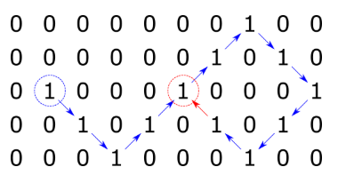

## 1. Zadatak

Napisati program koji pronalazi najveću sumu kontinuiranog pod-polja unutar zadanog polja cijelih brojeva te ispisuje
sumu te sadržaj pronađenog pod-polja.

S tipkovnice treba učitati vrijednosti za veličinu jednodimenzionalnog polja `m`. Ne treba provjeravati jesu li upisane
ispravne vrijednosti. Potrebno je učitati vrijednosti elemanata polja, te ispisati sadržaj pronađenog pod-polja kao i
iznos najveće sume pod-polja. Pogledati primjere niže za pojašnjenja (nisu primjeri izvršavanja programa):

```
Polje od 9 članova {8 3 8 -5 4 3 -4 3 5}
ima najveću sumu kada se zbroji svih 9 članova: 25
```

```
Polje od 9 članova {8 3 8 -5 4 3 -4 3 -2}
ima najveću sumu kada se zbroji prvih 6 članova: 21
```

```
Polje od 12 članova {38 3 -50 100 200 300 400 500 600 700 800 900}
ima najveću sumu kada se zbroje članovi 4..12: 4500
```

```
Polje od 4 člana {38 3 -50 100}
ima najveću sumu kada se računa član: 4
```

Napomena: polje treba definirati tako da se za njegovu pohranu troši minimalni potreban prostor.

Primjeri izvršavanja programa:

```
Upisite·velicinu·polja·m·>·9↵
Upisite·9·clanova·polja·m·>·8·3·8·-5·4·3·-4·3·5↵
Pronadjeno·pod-polje·:·8·3·8·-5·4·3·-4·3·5↵
Najveca·suma·kontinuiranog·pod-polja·je:·25
```

```
Upisite·velicinu·polja·m·>·9↵
Upisite·9·clanova·polja·m·>·8·3·8·-5·4·3·-4·3·-2↵
Pronadjeno·pod-polje·:·8·3·8·-5·4·3↵
Najveca·suma·kontinuiranog·pod-polja·je:·21
```

```
Upisite·velicinu·polja·m·>·12↵
Upisite·12·clanova·polja·m·>·38·3·-50·100·200·300·400·500·600·700·800·900↵
Pronadjeno·pod-polje·:·100·200·300·400·500·600·700·800·900↵
Najveca·suma·kontinuiranog·pod-polja·je:·4500
```

```
Upisite·velicinu·polja·m·>·4↵
Upisite·4·clanova·polja·m·>·38·3·-50·100↵
Pronadjeno·pod-polje·:·100↵
Najveca·suma·kontinuiranog·pod-polja·je:·100
```

Napomena: Znak `↵` ukazuje da na tom mjestu treba "ispisati skok u novi red" ili pritisnuti tipku Enter (odnosno
Return), a znak `·` da na tom mjestu treba ispisati prazninu (space).

[Rješenje zadatka](1.c)

## 2. Zadatak

Napišite program koji će za dvodimenzijsko polje cijelih brojeva s jednakim brojem redaka i stupaca N (kvadratnu
matricu) izračunati sumu svih brojeva koji se nalaze u zadanom retku i stupcu. Element matrice u kojem se zadani redak i
stupac "sijeku" zbraja se samo jedanput.

S tipkovnice program treba učitati prirodni broj N. Zatim je potrebno s tipkovnice učitati po retcima članove kvadratne
matrice. Na kraju je potrebno učitati redni broj retka i stupca čije elemente zbrajamo (0 je redni broj prvog
retka/stupca). Nije potrebno provjeravati ispravnost unesenih vrijednosti.

Napomena: dvodimenzijsko polje definirati tako da se za njegovu pohranu troši minimalni potreban prostor.

Primjeri izvršavanja programa:

```
Upisite·broj·redaka/stupaca·matrice·>·3↵
Upisite·3x3·clanova·>·↵
9·-3·4↵
5·2·-1↵
-3·4·5↵
Upisite·redni·broj·retka·>·0↵
Upisite·redni·broj·stupca·>·2↵
Suma·brojeva·koji·se·nalaze·u·retku·0·i·stupcu·2·je·14.
```

9 + (-3) + 4 + (-1) + 5 = 14

```
Upisite·broj·redaka/stupaca·matrice·>·4↵
Upisite·4x4·clanova·>·↵
9·-3·4·0↵
3·-2·-1·1↵
3·-2·0·0↵
1·6·0·0↵
Upisite·redni·broj·retka·>·3↵
Upisite·redni·broj·stupca·>·2↵
Suma·brojeva·koji·se·nalaze·u·retku·3·i·stupcu·2·je·10.
```

1 + 6 + 0 + 0 + 0 + (-1) + 4 = 10

Napomena: Znak `↵` ukazuje da na tom mjestu treba "ispisati skok u novi red" ili pritisnuti tipku Enter (odnosno
Return), a znak `·` da na tom mjestu treba ispisati prazninu (space).

[Rješenje zadatka](2.c)

## 3. Zadatak

Napišite program koji će učitati prirodni broj `n` iz intervala `[1, 10]`. Broj n predstavlja dimenzije kvadratne
matricu (`n x n`). Nadalje, program treba učitati vrijednosti matrice po retcima.

Za svaki stupac, potrebno je ispisati razliku suma trenutnog stupca i sljedećeg stupca. Od sume zadnjeg stupca potrebno
je oduzeti sumu prvog stupca.

Nije potrebno provjeravati ispravnost unesenih vrijednosti.

Napomena: dvodimenzijsko polje definirati tako da se za njegovu pohranu troši minimalni potreban prostor.

Primjer izvođenja programa:

```
Unesite·n·>·3↵
0·1·2↵
1·2·3↵
2·3·4↵
Rezultat·>·-3·-3·6↵
```

```
Unesite·n·>·2↵
0·0↵
1·1↵
Rezultat·>·0·0↵
```

```
Unesite·n·>·5↵
1·1·1·1·1↵
5·4·3·2·1↵
5·5·3·3·1↵
1·2·3·4·5↵
2·3·4·5·1↵
Rezultat·>·-1·1·-1·6·-5↵
```

Napomena: Znak `↵` ukazuje da na tom mjestu treba "ispisati skok u novi red" ili pritisnuti tipku Enter (odnosno
Return), a znak `·` da na tom mjestu treba ispisati prazninu (space).

[Rješenje zadatka](3.c)

## 4. Zadatak

S tipkovnice učitati cijele brojeve `N`, `M`, `idxi` i `idxj`. Nije potrebno provjeravati njihovu ispravnost.
Zatim inicijalizirati dvodimenzijsko polje polje veličine `N(redaka) x M(stupaca)` tako da nakon inicijalizacije svaki
član polja ima vrijednost `0`.

Potom, počevši od člana `polje[idxi][idxj]` popuniti matricu `polje` prema sljedećim pravilima:

- Ako je vrijednost trenutnog člana `polje[idxi][idxj]` jednaka 1, popunjavanje matrice je gotovo
- Ako je vrijednost trenutnog člana `polje[idxi][idxj]` jednaka 0, postavite mu vrijednost na 1,
  te se pomaknite po retcima za `idxi = idxi + i_smjer` i po stupcima za `idxj = idxj + j_smjer`
- Ako bi kretanje rezultiralo izlaskom iz matrice tj. ako bi `idxi = idxi + i_smjer` ili `idxj = idxj + j_smjer`
  rezultirali izlaskom iz matrice, smjer kretanja se onda mijenja na sljedeći način:
- Kada stignemo do donjeg ili gornjeg ruba matrice, počinjemo se kretati po retcima u suprotnom smjeru (`-i_smjer`)
- Kada stignemo do desnog ili lijevog ruba matrice, počinjemo se kretati po stupcima u suprotnom smjeru (`-j_smjer`)
- U kutevima matrice je potrebno napraviti obje promjene smjera

Početni smjer kretanja je dijagonalno gore desno (indeks retka pada, a stupca raste):

- po retcima `i_smjer = -1`
- po stupcima `j_smjer = 1`

Na kraju ispišite dobivenu matricu `polje` nakon popunjavanja te duljinu prijeđenog puta (ukupni broj pomaka).

Primjer izvršavanja:

```
Upisite·brojeve·N,·M,·idxi·i·idxj·>·5·10·2·1↵
0·0·0·1·0·0·0·1·0·0·↵
0·0·1·0·1·0·1·0·1·0·↵
0·1·0·0·0·1·0·0·0·1·↵
0·0·0·0·0·0·1·0·1·0·↵
0·0·0·0·0·0·0·1·0·0·↵
Duljina:·12↵
```

Napomena: Znak `↵` ukazuje da na tom mjestu treba "ispisati skok u novi red" ili pritisnuti tipku Enter (odnosno
Return), a znak `·` da na tom mjestu treba ispisati prazninu (space).

Dodatno objašnjenje primjera:


[Rješenje zadatka](4.c)

## 5. Zadatak

S tipkovnice učitati cijele brojeve `N`, `M`, `idxi` i `idxj`. Nije potrebno provjeravati njihovu ispravnost.
Zatim inicijalizirati dvodimenzijsko `polje` polje veličine `N(redaka) x M(stupaca)` tako da nakon inicijalizacije svaki
član polja ima vrijednost `0`.

Potom, počevši od člana `polje[idxi][idxj]` popuniti matricu polje prema sljedećim pravilima:

- Ako je vrijednost trenutnog člana `polje[idxi][idxj]` jednaka 1, popunjavanje matrice je gotovo
- Ako je vrijednost trenutnog člana `polje[idxi][idxj]` jednaka 0, postavite mu vrijednost na 1,
  te se pomaknite po retcima za `idxi = idxi + i_smjer` i po stupcima za `idxj = idxj + j_smjer`
- Ako bi kretanje rezultiralo izlaskom iz matrice tj. ako bi `idxi = idxi + i_smjer` ili `idxj = idxj + j_smjer`
  rezultirali izlaskom iz matrice, smjer kretanja se mijenja na sljedeći način:
- Kada stignemo do donjeg ili gornjeg ruba matrice, počinjemo se kretati po retcima u suprotnom smjeru (`-i_smjer`)
- Kada stignemo do desnog ili lijevog ruba matrice, počinjemo se kretati po stupcima u suprotnom smjeru (`-j_smjer`)
- U kutevima matrice je potrebno napraviti obje promjene smjera

Početni smjer kretanja je dijagonalno dolje lijevo (indeks retka raste, a stupca pada):

- po retcima `i_smjer = 1`
- po stupcima `j_smjer = -1`

Na kraju ispišite dobivenu matricu `polje` nakon popunjavanja te duljinu prijeđenog puta (ukupni broj pomaka).

Primjer izvršavanja:

```
Upisite·brojeve·N,·M,·idxi·i·idxj·>·5·10·2·3↵
0·0·0·1·0·0·0·1·0·0·↵
0·0·1·0·1·0·1·0·1·0·↵
0·1·0·1·0·1·0·0·0·1·↵
1·0·1·0·0·0·1·0·1·0·↵
0·1·0·0·0·0·0·1·0·0·↵
Duljina:·16↵
```

Napomena: Znak `↵` ukazuje da na tom mjestu treba "ispisati skok u novi red" ili pritisnuti tipku Enter (odnosno
Return), a znak `·` da na tom mjestu treba ispisati prazninu (space).

Dodatno objašnjenje primjera : Počinje se na plavom krugu, a završava na crvenom krugu.



[Rješenje zadatka](5.c)

## 6. Zadatak

S tipkovnice učitati cijele brojeve `N`, `M`, `idxi` i `idxj`. Nije potrebno provjeravati njihovu ispravnost.
Zatim inicijalizirati dvodimenzijsko `polje` polje veličine `N(redaka) x M(stupaca)` tako da nakon inicijalizacije svaki
član polja ima vrijednost `0`.

Potom, počevši od člana `polje[idxi][idxj]` popuniti matricu polje prema sljedećim pravilima:

- Ako je vrijednost trenutnog člana `polje[idxi][idxj]` jednaka 1, popunjavanje matrice je gotovo
- Ako je vrijednost trenutnog člana `polje[idxi][idxj]` jednaka 0, postavite mu vrijednost na 1,
  te se pomaknite po retcima za `idxi = idxi + i_smjer` i po stupcima za `idxj = idxj + j_smjer`
- Ako bi kretanje rezultiralo izlaskom iz matrice tj. ako bi `idxi = idxi + i_smjer` ili `idxj = idxj + j_smjer`
  rezultirali izlaskom iz matrice, smjer kretanja se mijenja na sljedeći način:
- Kada stignemo do donjeg ili gornjeg ruba matrice, počinjemo se kretati po retcima u suprotnom smjeru (`-i_smjer`)
- Kada stignemo do desnog ili lijevog ruba matrice, počinjemo se kretati po stupcima u suprotnom smjeru (`-j_smjer`)
- U kutevima matrice je potrebno napraviti obje promjene smjera

Početni smjer kretanja je dijagonalno dolje desno (indeks retka raste, indeks stupca raste):

- po retcima `i_smjer = 1`
- po stupcima `j_smjer = 1`

Na kraju ispišite dobivenu matricu polje nakon popunjavanja te duljinu prijeđenog puta (ukupni broj pomaka).

Primjer izvršavanja:

```
Upisite·brojeve·N,·M,·idxi·i·idxj·>·5·10·2·1↵
0·0·0·0·0·0·0·1·0·0·↵
0·0·0·0·0·0·1·0·1·0·↵
0·1·0·0·0·1·0·0·0·1·↵
0·0·1·0·1·0·1·0·1·0·↵
0·0·0·1·0·0·0·1·0·0·↵
Duljina:·12↵
```

Napomena: Znak `↵` ukazuje da na tom mjestu treba "ispisati skok u novi red" ili pritisnuti tipku Enter (odnosno
Return), a znak `·` da na tom mjestu treba ispisati prazninu (space).

Dodatno objašnjenje primjera : Počinje se na plavom krugu, a završava na crvenom krugu.



[Rješenje zadatka](6.c)

## 7. Zadatak

S tipkovnice učitati niz znakova (string) koji sigurno neće biti dulji od 150 znakova.
Niz može sadržavati bilo koji znak ASCII tablice koji se može tiskati (pozicije 32-126).
Treba napisati program koji će ukloniti sve znakove koji su uneseni, a koji nisu dio engleske abecede. Ukoliko ulazni
string ne sadrži niti jedan znak engleskog alfabeta treba ispisati tekst `prazan string`.

Primjeri izvršavanja programa:

```
Upisite·znakovni·niz·>·p2'r-o@gram84iz./↵
Izlazni·znakovni·niz·je·:·programiz↵
```

```
Upisite·znakovni·niz·>·12321[]↵
Izlazni·znakovni·niz·je·:·prazan·string↵
```

```
Upisite·znakovni·niz·>·Na·mladima·svijet·ostaje!?↵
Izlazni·znakovni·niz·je·:·Namladimasvijetostaje↵
```

Napomena: Znak `↵` ukazuje da na tom mjestu treba "ispisati skok u novi red" ili pritisnuti tipku Enter (odnosno
Return), a znak `·` da na tom mjestu treba ispisati prazninu (space).

[Rješenje zadatka](7.c)

## 8. Zadatak

S tipkovnice učitati niz znakova (string) koji sigurno neće biti dulji od 200 znakova.
Niz može sadržavati bilo koji znak ASCII tablice koji se može tiskati (pozicije 32-126).
Odredite i na zaslon ispišite obrnuti niz i pri tome sva mala slova pretvorite u velika.

Primjeri izvršavanja programa:

```
Upisite·znakovni·niz·>·PrImJer↵
Obrnuti·niz:·REJMIRP↵
```

```
Upisite·znakovni·niz·>·Ovo·je·Testni·primjer99↵
Obrnuti·niz:·99RJEMIRP·INTSET·EJ·OVO↵
```

Napomena: Znak `↵` ukazuje da na tom mjestu treba "ispisati skok u novi red" ili pritisnuti tipku Enter (odnosno
Return), a znak `·` da na tom mjestu treba ispisati prazninu (space).

[Rješenje zadatka](8.c)

## 9. Zadatak

S tipkovnice je potrebno učitati niz znakova (`string`) `niz`. Niz neće biti dulji od `50` znakova te ga ne treba
provjeravati.

Potrebno je ispisati koji se znak najčešće pojavljuje u nizu `niz` te koliko se puta ponovio taj znak.

```
Znak·"A"·se·ponavlja·5·puta.
```

Ukoliko postoji više znakova koji se ponavljaju jednako puta, tada je potrebno ispisati sve znakove, te njihov broj
ponavljanja. Ispis znakova treba biti takav da se prvo ispisuje onaj znak koji ima najmanju vrijednost u ASCII tablici
pa nakon njega znak sa sljedećom najmanjom vrijednosti i tako dalje.

```
Znakovi·"A",·"C",·"a"·se·ponavljaju·3·puta.
```

Ako je na kraju niza učitana oznaka za novi red, potrebno ju je izbaciti.

Primjeri izvršavanja programa:

```
Unesite·niz·>·aaaaAA↵
Znak·"a"·se·ponavlja·4·puta.↵
```

```
Unesite·niz·>·Ovojetest↵
Znakovi·"e",·"t"·se·ponavljaju·2·puta.↵
```

```
Unesite·niz·>·Znak·aaa·se·ponavlja·6·puta.↵
Znak·"a"·se·ponavlja·7·puta.↵
```

Napomena: Znak `↵` ukazuje da na tom mjestu treba "ispisati skok u novi red" ili pritisnuti tipku Enter (odnosno
Return), a znak `·` da na tom mjestu treba ispisati prazninu (space).

[Rješenje zadatka](9.c)

