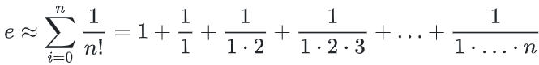

## 1. Zadatak

Napišite program koji s tipkovnice učitava broj (tipa `unsigned short int`) te ispisuje binarni zapis izmijenjenog
broja (bit po bit počevši od najznačajnijeg bita).
Potom program pronalazi i ispisuje indeks (0 do 15) najznačajnijeg bita postavljenog na vrijednost 1.

Napomena: nije dopušteno koristiti polja (array).

Primjeri izvršavanja:

```
Unesite·broj·>·0↵
Binarni·zapis·ucitanog·broja:·0000000000000000↵
Nema·bita·s·vrijednosti·1.
```

```
Unesite·broj·>·65535↵
Binarni·zapis·ucitanog·broja:·1111111111111111↵
Indeks·najznacajnijeg·bita·s·vrijednosti·1:·15
```

```
Unesite·broj·>·550↵
Binarni·zapis·ucitanog·broja:·0000001000100110↵
Indeks·najznacajnijeg·bita·s·vrijednosti·1:·9
```

Napomena: Znak `↵` ukazuje da na tom mjestu treba "ispisati skok u novi red" ili pritisnuti tipku Enter (odnosno
Return), a znak `·` da na tom mjestu treba ispisati prazninu (space).

[Rješenje](1.c)

## 2. Zadatak

Napišite program koji s tipkovnice učitava broj (tipa `unsigned short int`) te ispisuje binarni zapis učitanog broja (
bit po bit počevši od najznačajnijeg bita).
Potom program pronalazi i ispisuje indeks (0 do 15) najmanje značajnog bita postavljenog na vrijednost 0.

Napomena: nije dopušteno koristiti polja (array).

Primjeri izvršavanja:

```
Unesite·broj·>·65535↵
Binarni·zapis·ucitanog·broja:·1111111111111111↵
Nema·bita·s·vrijednosti·0.
```

```
Unesite·broj·>·0↵
Binarni·zapis·ucitanog·broja:·0000000000000000↵
Indeks·najmanje·znacajnog·bita·s·vrijednosti·0:·0
```

```
Unesite·broj·>·551↵
Binarni·zapis·ucitanog·broja:·0000001000100111↵
Indeks·najmanje·znacajnog·bita·s·vrijednosti·0:·3
```

Napomena: Znak `↵` ukazuje da na tom mjestu treba "ispisati skok u novi red" ili pritisnuti tipku Enter (odnosno
Return), a znak `·` da na tom mjestu treba ispisati prazninu (space).

[Rješenje](2.c)

## 3. Zadatak

Napišite program koji s tipkovnice učitava dva broja (tipa `unsigned short int`) te ispisuje Hammingovu udaljenost za ta
dva broja.
Hammingova udaljenost je broj pozicija na kojima se bitovi razlikuju.

Napomena: nije dopušteno koristiti polja (array).

Primjeri izvršavanja:

```
Unesite·dva·broja·>·0·65535↵
Hammingova·udaljenost:·16
```

```
Unesite·dva·broja·>·0·550↵
Hammingova·udaljenost:·4
```

Napomena: Znak `↵` ukazuje da na tom mjestu treba "ispisati skok u novi red" ili pritisnuti tipku Enter (odnosno
Return), a znak `·` da na tom mjestu treba ispisati prazninu (space).

[Rješenje](3.c)

## 4. Zadatak

Napišite program koji s tipkovnice učitava broj (tipa `unsigned short int`) i na standardni izlaz ispisuje binarni zapis
učitanog broja (bit po bit počevši od najznačajnijeg bita).

Potom program s tipkovnice treba učitavati po dva cijela broja koji predstavljaju:

- poziciju bita (pozicija 0 se odnosi na najmanje značajan bit, a 15 na najznačajniji bit)
- vrijednost na koju treba postaviti bit učitanog broja na toj poziciji
  Nakon učitanog para brojeva potrebno je postaviti bit na učitanoj poziciji na tu (netom učitanu) vrijednost.

Učitavanje treba prekinuti kad se za poziciju učita vrijednost koja nije u intervalu [0, 15] ili kada se za vrijednost
na koju treba postaviti bit broja učita vrijednost koja nije 0 ili 1.

Na kraju, program treba ispisati dekadski zapis izmijenjenog broja i binarni zapis izmijenjenog broja (bit po bit,
počevši od najznačajnijeg bita).

Napomena: nije dopušteno koristiti polja (array).

Primjeri izvršavanja:

```
Unesite·broj·>·65535↵
Binarni·zapis·broja:·1111111111111111↵
↵
Unesite·indeks·i·vrijednost·bita·>·0·0↵
Unesite·indeks·i·vrijednost·bita·>·15·0↵
Unesite·indeks·i·vrijednost·bita·>·8·1↵
Unesite·indeks·i·vrijednost·bita·>·-3·1↵
↵
Dekadski·i·binarni·zapis·izmijenjenog·broja:·32766·0111111111111110
```

```
Unesite·broj·>·2000↵
Binarni·zapis·broja:·0000011111010000↵
↵
Unesite·indeks·i·vrijednost·bita·>·2·1↵
Unesite·indeks·i·vrijednost·bita·>·4·0↵
Unesite·indeks·i·vrijednost·bita·>·5·3↵
↵
Dekadski·i·binarni·zapis·izmijenjenog·broja:·1988·0000011111000100
```

```
Unesite·broj·>·2000↵
Binarni·zapis·broja:·0000011111010000↵
↵
Unesite·indeks·i·vrijednost·bita·>·-17·5↵
↵
Dekadski·i·binarni·zapis·izmijenjenog·broja:·2000·0000011111010000
```

Napomena: Znak `↵` ukazuje da na tom mjestu treba "ispisati skok u novi red" ili pritisnuti tipku Enter (odnosno
Return), a znak `·` da na tom mjestu treba ispisati prazninu (space).

[Rješenje](4.c)

## 5. Zadatak

Napisati funkciju naziva e_approx tipa double, koja za zadani prirodni broj `n` (parametar tipa int) računa
aproksimaciju Eulerove konstante po formuli 

Napisati glavni program koji s tipkovnice učitava prirodni broj `n`, ispisuje vrijednost `e` izračunatu pomoću funkcije
e_approx uz parametar `n`. Zatim ispisuje razliku izračunate vrijednosti e_approx i vrijednosti konstante `e`. Konstanta
`e` se računa pozivom funkcije exp(1), definirane u biblioteci "math.h".

Sve vrijednosti ispisati s 12 znamenki iza decimalne točke kao u navedim primjerima ispisa programa. Primjeri
izvršavanja programa:

```
Upisite·broj·n:·4↵
Aproksimacija·e:·2.708333333333↵
Razlika:·-0.009948495126
```

```
Upisite·broj·n:·50↵
Aproksimacija·e:·2.718281828459↵
Razlika:·0.000000000000
```

Napomena: Znak `↵` ukazuje da na tom mjestu treba "ispisati skok u novi red" ili pritisnuti tipku Enter (odnosno
Return), a znak `·` da na tom mjestu treba ispisati prazninu (space).

[Rješenje](5.c)

## 6. Zadatak

Napišite funkciju naziva median tipa float koja će primati 3 realna broja a, b i c te vraćati njihov median.
Medijan je vrijednost u sredini grupe brojeva; odnosno, pola brojeva u grupi ima vrijednost veću od medijana, a pola
brojeva ima vrijednost manju od medijana. Na primjeru od tri broja, medijan je uvijek srednji broj po vrijednosti.

Napisati glavni program koji s tipkovnice učitava tri realna broja, poziva funkciju median te ispisuje apsolutnu
vrijednost razlike između mediana i srednje vrijednosti upisanih brojeva.

Sve realne vrijednosti ispisati s tri znamenke iza decimalne točke kao u navedenim primjerima ispisa programa. Primjeri
izvršavanja programa:

```
Upisite·tri·realna·broja·>·3·5·8↵
Apsolutna·vrijednost·razlike·mediana·i·srednje·vrijednosti·je:·0.333
```

```
Upisite·tri·realna·broja·>·2.6·23.5·1.0
Apsolutna·vrijednost·razlike·mediana·i·srednje·vrijednosti·je:·6.433
```

Napomena: Znak `↵` ukazuje da na tom mjestu treba "ispisati skok u novi red" ili pritisnuti tipku Enter (odnosno
Return), a znak `·` da na tom mjestu treba ispisati prazninu (space).

[Rješenje](6.c)

## 7. Zadatak

1. Napisati funkciju naziva djelitelj tipa int, koja za dva zadana prirodna broja `a` i `b` (parametri tipa int) računa
   najveći zajednički djelitelj.

2. Napisati funkciju naziva reduciraj tipa void, koja za zadane brojnik i nazivnik `br` i `naz`, koji predstavljaju
   razlomak `br/naz` ispisuje reducirani oblik tog razlomka. Za izračun reduciranog razlomka koristiti funkciju
   djelitelj.

3. Napisati glavni program koji s tipkovnice učitava prirodne brojeve `br` i `naz`, ispisuje razlomak `br/naz` te
   ispisuje njegov reducirani oblik korištenjem funkcije reduciraj.

Primjeri izvršavanja programa:

```
Upisite·brojnik·i·nazivnik:·774·1032↵
Razlomak:·774/1032↵
Reduciran:·3/4
```

```
Upisite·brojnik·i·nazivnik:·8·4↵
Razlomak:·8/4↵
Reduciran:·2
```

Napomena: Znak `↵` ukazuje da na tom mjestu treba "ispisati skok u novi red" ili pritisnuti tipku Enter (odnosno
Return), a znak `·` da na tom mjestu treba ispisati prazninu (space).

[Rješenje](7.c)

## 8. Zadatak

Napisati funkciju savrsen_kvadrat tipa int koja kao ulaz prima prirodni broj te kao izlaz vraća 1 ako je taj broj
savršen kvadrat, a ako nije onda vraća 0. Savršen kvadrat je broj dobiven kvadriranjem cijelog broja, npr. 16 je savršen
kvadrat, jer je $\sqrt{16}$ = 4.

Napisati funkciju factorial tipa int koja također kao ulaz prima prirodni broj, a kao izlaz vraća faktorijelu unesenog
broja.

Napisati funkciju zbroj_znamenaka tipa int koja kao ulaz prima prirodni broj, a kao izlaz vraća zbroj njegovih
znamenaka.

Napisati glavni program koji učitava prirodni broj s tipkovnice, računa faktorijelu unesenog broja korištenjem funkcije
factorial, računa zbroj znamenaka dobivene faktorijele korištenjem funkcije zbroj_znamenaka te ispisuje je li dobiveni
zbroj savršen kvadrat korištenjem funkcije savrsen_kvadrat.

Primjeri izvršavanja programa:

```
Upisite·prirodni·broj·>·6↵
Suma·znamenaka·od·6!·je·savrsen·kvadrat.
```

```
Upisite·prirodni·broj·>·2↵
Suma·znamenaka·od·2!·nije·savrsen·kvadrat.
```

Napomena: Znak `↵` ukazuje da na tom mjestu treba "ispisati skok u novi red" ili pritisnuti tipku Enter (odnosno
Return), a znak `·` da na tom mjestu treba ispisati prazninu (space).

[Rješenje](8.c)
