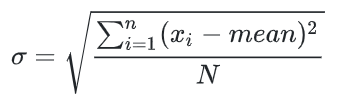

## 1. Zadatak

Deklarirana je struktura

```c++
struct person_s {
    int code;
    char name[128];
    float salary;
}
```

Napisati funkciju s prototipom

```c++
void delCharFromName(struct person_s *s, char c);
```

koja iz polja name u strukturi na koju pokazuje s izbacuje sve pojave znaka c.

Primjeri izvršavanja:

Niz "mali Perica" uz znak 'a' mijenja se u "mli Peric".

Niz "ccc" uz znak 'c' mijenja se u "" (prazan niz).

Niz "FER" uz znak 'e' ostaje nepromijenjen.

Primjer glavnog programa za testiranje funkcije izvan Edgara

```c++
#include <stdio.h>
// definicija funkcije delCharFromName
int main(void) {
    struct person_s s;
    char c;
    printf("Unesite niz > ");
    fgets(s.name, 128, stdin);
    printf("Unesite znak > ");
    scanf("%c", &c);
    // ovdje ugraditi poziv funkcije
    printf("%s", s.name);
    return 0;
}
```

Važna napomena: Kao rješenje zadatka predaje se samo implementirana funkcija koja ne smije sadržavati naredbe za ispis
na standardni izlaz ili unos sa standardnog ulaza. Funkcija `main` i zaglavlja se ne predaju. Za razliku od ove
pripreme, na stvarnoj laboratorijskoj vježbi nećete dobiti funkciju `main`.

[Rješenje](1.c)

## 2. Zadatak

Napisati funkciju `duplicirajSamoglasnike` prototipa:

```c++
void duplicirajSamoglasnike(char *ulaz, char *izlaz)
```

Funkcija treba duplicirati svako pojavljivanje samoglasnika u nizu znakova na čiji prvi član pokazuje prvi parametar
funkcije (parametar `ulaz`) te taj niz s dupliciranim samoglasnicima zapisati u znakovni niz na čiji prvi član pokazuje
drugi parametar funkcije (parametar `izlaz`).

Primjeri izvršavanja:

```
Upisite·niz·>·abc↵
Rezultat:·aabc
```

```
Upisite·niz·>·Ananas↵
Rezultat:·AAnaanaas
```

```
Upisite·niz·>·primjer123↵
Rezultat:·priimjeer123
```

Važna napomena: Kao rješenje zadatka predaje se samo implementirana funkcija koja ne smije sadržavati naredbe za ispis
na standardni izlaz ili unos sa standardnog ulaza. Funkcija `main` i zaglavlja se ne predaju.

[Rješenje](2.c)

## 3. Zadatak

1. Potrebno je napisati funkciju `stddev` prototipa `void stddev(float *a, int n, float *std)` čiji je parametar *a
   pokazivač na prvi član polja, n duljina jednodimenzijskog polja te *std pokazivač na objekt u kojeg će biti upisan
   rezultat - standardna devijacij članova polja.

   Funkcija treba za jednodimenzijsko polje, zadanog broja članova izračunati standardnu devijaciju te preko pokazivača
   vratiti njenu vrijednost.

2. Potrebno je napisati funkciju `IndexOfMaxdev` prototipa `int IndexOfMaxdev(float *a, int n, int m)` čiji je
   parametar *
   a pokazivač na prvi član matrice, n broj redaka matrice te m broj stupaca matrice. Funkcija treba uz korištenje
   prethodno navedene funkcije stddev vratiti indeks onog retka čiji članovi imaju najveću standardnu devijaciju. Ako
   više redaka ima jednaku vrijednost standardne devijacije, onda treba vratiti redak s manjim indeksom.

Napomena formula za standardnu devijaciju glasi:



U pozivajućoj razini je osigurana memorija za sva korištena polja.

Primjer pomoću kojeg možete testirati funkcije:

```
    1  1   1
M = 2  3   4
    1 457 123

index = 2
```

```
    1  1
M = 2  3
    3  2
index = 1
```

Glavni program možete preuzeti ovdje

```c++
int main(void){
    float M[64];
    int m;
    int n;
    int index;
    scanf("%d", &n);
    scanf("%d", &m);
    for (int i = 0; i < n; i++) {
        for (int j = 0; j < m; j++) {
            scanf("%f", M+i*m+j);
        }
    }
    
    index = IndexOfMaxdev(M, n, m);
    printf("%d", index);
}
```

Važna napomena: Kao rješenje zadatka predaju se samo implementirane funkcije koje ne smiju sadržavati naredbe za ispis
na standardni izlaz ili unos sa standardnog ulaza. Funkcija `main` i zaglavlja se ne predaju. Za razliku od ove
pripreme, na stvarnoj laboratorijskoj vježbi nećete dobiti funkciju `main`.

[Rješenje](3.c)

## 4. Zadatak

Zadano je cjelobrojno dvodimenzijsko polje (matrica) dimenzija m x n, gdje je m broj redaka, a n broj stupaca.

Potrebno je:

1. Napisati funkciju `zajednickiDjelitelj` prototipa
   `int zajednickiDjelitelj(int *matrica, int m, int n)`
   koja pronalazi element u dvodimenzijskom polju (matrici) s kojim su djeljivi svi elementi matrice. Ako takav element
   postoji onda funkcija preko imena vraća njegovu vrijednost, a ako ne postoji onda vraća 1.
   Funkcija `zajednickiDjelitelj` kao parametre prima redom:
    - pokazivač na prvi član dvodimenzijskog polja (matrice),
    - broj redaka `m`,
    - broj stupaca `n`.
2. Napisati funkciju `podijeli` prototipa
   `void podijeli(int *matrica, int m, int n, int *rezultat)`
   koja u zadano odredišno dvodimenzijsko polje upisuje članove izvorišnog dvodimenzijskog polja podijeljene s
   vrijednosti funkcije `zajednickiDjelitelj` pozvane nad izvorišnim poljem.
   Funkcija podijeli kao parametre prima redom:
    - pokazivač na prvi član izvorišnog dvodimenzijskog polja (matrice),
    - broj redaka `m`,
    - broj stupaca `n`,
    - pokazivač na prvi član odredišnog dvodimenzijskog polja (matrice).

Napomena: Funkcija ne smije izmijeniti ulaznu matricu.

Primjeri izvršavanja:

```
Unesite·m·i·n·>·3·3↵
Unesite·clanove·matrice·>·1·2·3·4·5·6·7·8·9↵
Zajednicki·djelitelj:·1↵
Rezultat·funkcije·podijeli:↵
1·2·3↵
4·5·6↵
7·8·9↵
```

```
Unesite·m·i·n·>·2·3↵
Unesite·clanove·matrice·>·10·4·6·2·16·10↵
Zajednicki·djelitelj:·2↵
Rezultat·funkcije·podijeli:↵
5·2·3↵
1·8·5↵
```

Važna napomena: Kao rješenje zadatka predaju se samo implementirane funkcije koje ne smiju sadržavati naredbe za ispis
na standardni izlaz ili unos sa standardnog ulaza. Funkcija `main` i zaglavlja se ne predaju.

[Rješenje](4.c)

## 5. Zadatak

Potrebno je napisati

1. funkciju dot_produkt prototipa `int dot_produkt (int *a, int *b, int n)` čiji su parametri *a i *b pokazivači na prve
   članove polja objekata tipa int, a parametar n broj članova u tim poljima.
   Funkcija treba preko imena vratiti skalarni produkt vektora a i b.
2. funkciju mat_vec_produkt prototipa `void mat_vec_produkt(int *X, int *a, int n, int *ret)` čiji su parametri
    - *X pokazivač na prvi član kvadratne matrice X,
    - *a pokazivač na vektor a,
    - n broj stupaca i redaka matrice X odnosno broj elemenata vektora a,
    - *ret pokazivač na polje pomoću kojeg funkcija vraća rezultat.

   Polje ret nakon izvršavanja funkcije treba sadržavati rezultat množenja matrice X s vektorom a. Pri množenju je
   potrebno koristiti funkciju dot_produkt.

U pozivajućoj razini je osigurana memorija za sva korištena polja.

Primjer pomoću kojeg možete testirati funkcije:

```
  X    *  a  = ret
1 2 3     2     5
4 5 6  *  0  =  14
7 8 9     1     23
```

```
    X      *  a  = ret
0 0 0 0 1     5     1
0 0 0 1 0     4     2
0 0 1 0 0  *  3  =  3
0 1 0 0 0     2     4
1 0 0 0 0     1     5
```

Glavni program možete preuzeti ovdje

```c++
#define MAX_DIM 32

int main(void) {
    int X[MAX_DIM*MAX_DIM], a[MAX_DIM], n, rez[MAX_DIM], i;
   scanf("%d", &n);

   for(i=0; i < n*n; i++)
      scanf("%d", &X[i]);

   for(i=0; i < n; i++)
       scanf("%d", &a[i]);

   mat_vec_produkt(X, a, n, rez);

   for(i = 0; i < n; i++)
      printf("%d ", rez[i]);

   return 0;
}
```

Važna napomena: Kao rješenje zadatka predaju se samo implementirane funkcije koje ne smiju sadržavati naredbe za ispis
na standardni izlaz ili unos sa standardnog ulaza. Funkcija `main` i zaglavlja se ne predaju. Za razliku od ove
pripreme, na stvarnoj laboratorijskoj vježbi nećete dobiti funkciju `main`.

[Rješenje](5.c)

## 6. Zadatak

Potrebno je napisati funkciju obrni prototipa
`void obrni (char *src, char *dst)`
čija su oba parametara pokazivači na prvi član polja objekata tipa `char`.
Funkcija treba članove iz polja na koje pokazuje prvi parametar obrnutim redoslijedom premjestiti u polje na čiji prvi
član pokazuje drugi parametar funkcije.
U pozivajućoj razini je osigurana memorija za oba polja.

Primjeri pomoću kojih možete testirati funkcije:

```
src = "a1c2e3g4"
dst = ""
// poziv funkcije obrni(src, dst);
src = "a1c2e3g4"
dst = "4g3e2c1a"
```

```
src = "123"
dst = ""
// poziv funkcije obrni(src, dst);
src = "123"
dst = "321"
```

Glavni program možete preuzeti ovdje

```c++
int main(void) {
    char src[32], dst[32];
    scanf("%s", src);
    obrni(src, dst);
    printf("%s", dst);
    return 0;
}
```

Važna napomena: Kao rješenje zadatka predaju se samo implementirane funkcije koje ne smiju sadržavati naredbe za ispis
na standardni izlaz ili unos sa standardnog ulaza. Funkcija `main` i zaglavlja se ne predaju. Za razliku od ove
pripreme, na stvarnoj laboratorijskoj vježbi nećete dobiti funkciju `main`.

[Rješenje](6.c)

## 7. Zadatak

Potrebno je napisati funkciju `transponiraj` prototipa
`void transponiraj(int* src, int* dst, int n, int m)` čija su oba parametra pokazivači na prve članove polja objekata
tipa `int`.
Funkcija treba članove polja na koje pokazuje prvi parametar premjestiti u polje na čiji prvi član pokazuje drugi
parametar takvim redoslijedom da se na kraju dobije transponirana matrica.

U pozivajućoj razini je osigurana memorija za oba polja.

Primjeri pomoću kojih možete testirati funkcije:

```
    1 2 3
A = 4 5 6
    7 8 9

      1 4 7
A^T = 2 5 8
      3 6 9
```

```
    2 3
A = 5 6
    8 9

      2 5 8
A^T = 3 6 9
```

Glavni program možete preuzeti ovdje

```c++
int main(void) {
   int a[64];
   int b[64];
   int n;
   int m;
   
   scanf("%d", &n);
   scanf("%d", &m);
   
   
   for (int i = 0; i < n; i++) {
      for (int j = 0; j < m; j++) {
        scanf("%d", a+i*m+j);
      }
   }
   transponiraj(a, b, n, m);
   
   for (int i = 0; i < n; i++) {
      for (int j = 0; j < m; j++) {
        printf("%d ", a[i*m+j]);
      }
      printf("\n");
   }
   printf("\n\n");
   for (int i = 0; i < m; i++) {
      for (int j = 0; j < n; j++) {
        printf("%d ", b[i*n+j]);
      }
      printf("\n");
   }
}
```

Važna napomena: Kao rješenje zadatka predaju se samo implementirane funkcije koje ne smiju sadržavati naredbe za ispis
na standardni izlaz ili unos sa standardnog ulaza. Funkcija `main` i zaglavlja se ne predaju. Za razliku od ove
pripreme, na stvarnoj laboratorijskoj vježbi nećete dobiti funkciju `main`.

[Rješenje](7.c)

## 8. Zadatak

Napisati funkciju `prebrojiPojave` tipa `void` koja kao parametre prima:

- pokazivač na objekt tipa `char` koji pokazuje na početak znakovnog niza;
- objekt tipa `char`;
- pokazivač na objekt tipa `int` u koji je potrebno upisati rezultat funkcije.

Funkcija treba odrediti broj pojava slova, brojke ili drugog znaka (npr. `!` ili `#`) primljenih preko drugog
parametra (tipa `char`) u nizu na čiji početak pokazuje pokazivač primljen preko prvog parametra. Pritom je funkcija
case-insensitive - pri brojanju se velika i mala slova tretiraju isto. Rezultat treba vratiti u glavni program preko
pokazivača na objekt tipa `int` primljenog preko trećeg parametra.

Ispravnost argumenata ne treba provjeravati, tj. pretpostavite da će uvijek biti zadani valjani pokazivači na traženi
tip te ispravni znakovi (`char`).

Primjeri izvršavanja:

```
Ucitaj·znakovni·niz·>·Doobar·Dan↵
Ucitaj·trazeni·znak·>·o↵
Broj·pojavljivanja·>·2 ↵
```

```
Ucitaj·znakovni·niz·>·AnaVoliMilovana↵
Ucitaj·trazeni·znak·>·a↵
Broj·pojavljivanja·>·4↵
```

```
Ucitaj·znakovni·niz·>·AnaVoliMilovana↵
Ucitaj·trazeni·znak·>·A↵
Broj·pojavljivanja·>·4↵
```

```
Ucitaj·znakovni·niz·>·p·e·r·o...123↵
Ucitaj·trazeni·znak·>·2↵
Broj·pojavljivanja·>·1↵
```

Važna napomena: Kao rješenje zadatka predaju se samo implementirane funkcije koje ne smiju sadržavati naredbe za ispis
na standardni izlaz ili unos sa standardnog ulaza. Funkcija `main` i zaglavlja se ne predaju.

[Rješenje](8.c)
