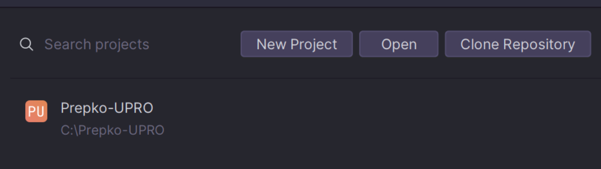
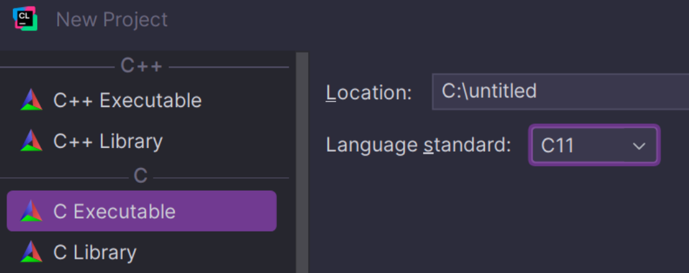

# Upute za instalaciju i konfiguriranje CLion IDE-a

## 📥 Instalacija

Potrebno je izraditi korisnički račun na sljedećoj poveznici:
[JetBrains Sign Up](https://account.jetbrains.com/signup)

Zatim potrebno je otići pod [edukacijsku licencu](https://www.jetbrains.com/academy/student-pack/) i ispuniti formular.

Nakon što ispunite formular stići će Vam mail sa poveznicom za aktivaciju licence na mail koji ste upisali.

Nakon uspješne aktivacije možete pogledati sve dostupne alate [ovdje](https://account.jetbrains.com/licenses) ili
direktno skinuti [CLion IDE](https://www.jetbrains.com/clion/)

## ⚙️ Konfiguracija alata

Kada skinete CLion IDE ili neki drugi željeni alat možete ga aktivirati prijavom na JetBrains korisnički račun u samom
IDE-u.

### Stvaranje novog projekta


**New Project**

Potrebno je odabrati "C Executable" i Language standard C11

Ukoliko želite skinuti ove zadatke
**Clone Repository**

U prozor zalijepiti poveznicu od ovog repozitorija:

```
https://github.com/Prepko/Prepko-UPRO/
```

## ❗❗ Napomena

Licencu je potrebno obnavljati svakih godinu dana od dana aktivacije.

## 📌 Poveznice

- [JetBrains Sign Up](https://account.jetbrains.com/signup)
- [Edukacijska licenca](https://www.jetbrains.com/academy/student-pack/)
- [Svi dostupni alati](https://account.jetbrains.com/licenses)
- [CLion IDE](https://www.jetbrains.com/clion/)